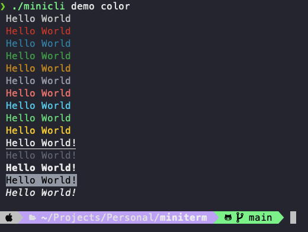
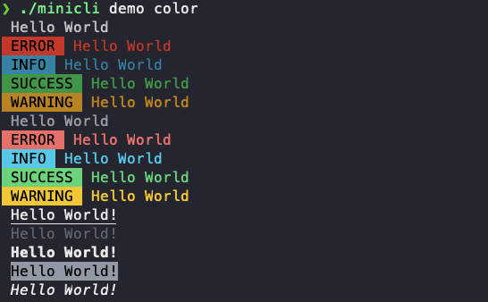

# Creating a new Minicli application

Minicli is a minimalist framework for building CLI-centric PHP applications. Minicli has no external package dependencies, and a single system requirement:

- PHP 8.1+ (cli)

> Note: If you want to obtain user input, then the [`readline`](https://www.php.net/manual/en/function.readline.php) PHP extension is required as well.

Apart from that, you'll need [Composer](https://getcomposer.org/) to install and use Minicli.

## Creating a Simple App

If all you need is to set up a few simple commands to run through Minicli, you can use a singe file for your application.

1. Create a directory for your new project
2. Run `composer require minicli/minicli` - this will create a `composer.json` file and download Minicli.
3. Create an executable PHP script with the following content:

```php
#!/usr/bin/php
<?php

if (php_sapi_name() !== 'cli') {
    exit;
}

require __DIR__ . '/vendor/autoload.php';

use Minicli\App;
use Minicli\Command\CommandCall;
use Minicli\Exception\CommandNotFoundException;

$app = new App();
$app->setSignature('./minicli mycommand');

$app->registerCommand('mycommand', function(CommandCall $input) {
    echo "My Command!";

    var_dump($input);
});

try {
    $app->runCommand($argv);
} catch (CommandNotFoundException $e) {
    echo 'An error occurred running the command: ',  $e->getMessage(), "\n";
}
```

This script will set up a command called `mycommand`. To execute it, first make the file executable with:

```bash
chmod +x script-name
```

Then, run your command with:

```bash
./script-name mycommand
```

## Creating a Structured App Using the Application Template

If you'd like to create an application with many commands, or you would prefer to have more structure to your commands, with support to subcommands, than you should use [Command Namespaces](/02-command_namespaces). 
To facilitate setting up such an application, we have the `minicli/application` repository, which serves as an application template you can use with `composer create-project`.

Create a new project with:

```shell
composer create-project --prefer-dist minicli/application myapp
```

This will generate a directory structure like the following:

```
.
├── app
│   └── Command
│       └── Demo
│           ├── DefaultController.php
│           ├── TableController.php
│           └── TestController.php
├── tests
│   ├── Feature
│   │   └── Command
│   │       └── DemoCommandTest.php
│   ├── Helpers.php
│   └── Pest.php
├── vendor/
├── composer.json
├── composer.lock
├── LICENSE
├── minicli
├── phpunit.xml
└── README.md


```

Each directory inside `app/Command` represents a Command Namespace.
The classes inside `app/Command/Demo` represent subcommands that you can access through the main `demo` command.

You can now run the boostrapped application with:

```shell
cd myapp
./minicli
```

This will show you the default app signature.

You can use the included `help` command to see a list of available commands. This should exhibit also the application-defined commands, in this case, the "demo" command.

```shell
./minicli help
```
```shell

Available Commands

demo
└──table
└──test

help

```
The `demo` command that comes with the application template, has a couple subcommands to demonstrate Minicli usage with Command Controllers.

The `demo test` command, defined in `app/Command/Demo/TestController.php`, shows an echo test of parameters:

```
./minicli demo test user=erika name=value
```

```
Hello, erika!

Array
(
    [user] => erika
    [name] => value
)
```

The `demo table` commands prints a table demo:

```shell
./minicli demo table
```

```shell
Testing Tables

Header 1  Header 2  Header 3        
1         8         other string 1  
2         10        other string 2  
3         4         other string 3  
4         6         other string 4  
5         7         other string 5  
6         5         other string 6  
7         6         other string 7  
8         10        other string 8  
9         0         other string 9  
10        1         other string 10 
```

Check out the [Creating Controllers](/getting_started/creating-controllers) section for more information about how command namespaces and controllers work.

## Creating a Structured App Using MiniTerm

**[MiniTerm](https://github.com/minicli/miniterm)** is a template based in the **Application Template** above but extended with:

- [Termwind](https://github.com/nunomaduro/termwind) for creating beautiful CLI interfaces.
- [Plates](https://github.com/thephpleague/plates) as a template engine.

Create a new project with:

```shell
composer create-project --prefer-dist minicli/miniterm myapp
```

This will generate a directory structure like the following:

```
.
├── app
│   ├── Command
│   │   ├── BaseController.php
│   │   └── Demo
│   │       ├── AskController.php
│   │       ├── ColorController.php
│   │       ├── DefaultController.php
│   │       ├── TableController.php
│   │       └── TestController.php
│   ├── Config
│   │   ├── TermwindOutputConfig.php
│   │   └── TermwindOutputHandler.php
│   ├── Services
│   │   ├── PlatesServicec.php
│   │   └── TermwindService.php
│   └── Views
│   │   └── table.php
├── tests
│   ├── Feature
│   │   └── Command
│   │       └── DemoCommandTest.php
│   ├── Helpers.php
│   └── Pest.php
├── vendor/
├── composer.json
├── composer.lock
├── LICENSE
├── minicli
├── pint.json
├── phpunit.xml
└── README.md


```

Each directory inside `app/Command` represents a Command Namespace.
The classes inside `app/Command/Demo` represent subcommands that you can access through the main `demo` command.

You can now run the boostrapped application with:

```shell
cd myapp
./minicli
```

This will show you the default app signature.

You can use the included `help` command to see a list of available commands. This should exhibit also the application-defined commands, in this case, the "demo" command.

```shell
./minicli help
```
```shell

Available Commands

demo
└──ask
└──color
└──table
└──test

help

```
The `demo` command that comes with the application template, has a couple subcommands to demonstrate MiniTerm usage with Command Controllers.

The `demo ask` command, defined in `app/Command/Demo/AskController.php`, shows how to ask for user input and render a message styled with Termwind:

```shell
./minicli demo ask
```

```shell
What is your name? Erika

Miniterm Hello, erika!
```

The `demo color` command, defined in `app/Command/Demo/ColorController.php`, shows how to render a message styled with Termwind using color helpers:

```shell
./minicli demo color
```



The `demo test` command, defined in `app/Command/Demo/TestController.php`, shows how to render a message styled with Termwind using param inputs:

```
./minicli demo test user=erika
```

```
Miniterm Hello, erika!
```

The `demo table` commands prints a table demo using Plates to render a view file:

```shell
./minicli demo table
```

```shell
+----------+----------+-----------------+
| Header 1 | Header 2 | Header 3        |
+----------+----------+-----------------+
| 1        | 8        | other string 1  |
| 2        | 6        | other string 2  |
| 3        | 8        | other string 3  |
| 4        | 2        | other string 4  |
| 5        | 3        | other string 5  |
| 6        | 8        | other string 6  |
| 7        | 1        | other string 7  |
| 8        | 0        | other string 8  |
| 9        | 8        | other string 9  |
| 10       | 3        | other string 10 |
+----------+----------+-----------------+
```

All your application commands should extend the `BaseController` class, which provides helper methods for rendering output with Termwind and Plates:

- `render`: Used to render an HTML string using Termwind.
- `style`: Used to add own custom styles and also update colors.
- `ask`: Used to ask for user input.
- `terminal`: returns an instance of the Terminal class, with the following methods:
    - `width`: returns the full width of the terminal.
    - `height`: returns the full height of the terminal.
    - `clear`: clears the terminal.
- `view`: Used to render a view file using Termwind and Plates.

### Configuring the Output Styles

You can configure the output styles by editing the `app/Config/TermwindOutputConfig.php` file.

You can update the css classes in the `styles` method to change the appearance of the output.

You can configure if you want to show labels for the commands and subcommands by updating the `enableLabels` method.
When set to true the output will look like this:



You can also configure which styles should display labels by updating the `stylesWithLabels` method.

### Creating a View

You can create a view file in the `app/Views` directory and use it in a command controller like this:

```shell
touch app/Views/hello.php
```

```html
<p>Hello, <?= $name ?>!</p>
```

```php
<?php

class TableController extends BaseController
{
    public function handle(): void
    {
        $this->view('hello', [
            'name' => 'Erika',
        ]);
    }
}
```
