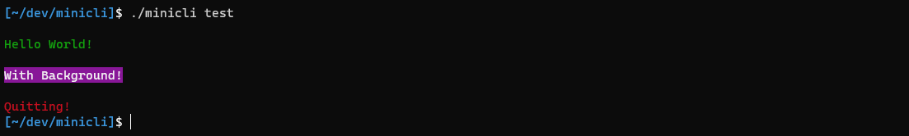

# About
<p align="center">

</p>

<p align="center">
    <a href="//packagist.org/packages/minicli/minicli">
        
    </a>
    <a href="//packagist.org/packages/minicli/minicli">
        
    </a>
    <a href="//packagist.org/packages/minicli/minicli">
        
    </a>
    <a href="https://docs.minicli.dev/en/latest/?badge=latest">
        
    </a>
</p>

Minicli is a minimalist, zero-dependency framework for building CLI-centric PHP applications. It provides a structured way to organize your commands, as well as various helpers to facilitate working with command arguments, obtaining input from users, and printing colored output to the terminal. Since version 3.0, Minicli requires PHP 8.

## Requirements

- PHP >= 8.0
- `ext-readline` to obtain user input

Apart from that, you'll need [Composer](https://getcomposer.org/) to install and use Minicli.

### Zero Dependencies 
Minicli is committed to creating a safer software supply chain ecosystem, that's why we don't bring any chained dependencies with the base `minicli/minicli` package. Starting from version `3.2.0`, we also include [SBOM](https://en.wikipedia.org/wiki/Software_supply_chain) files with every release of Minicli. You can [download here](https://github.com/minicli/minicli/releases/download/3.2.0/sbom.spdx) our latest SBOM in SPDX format.

The base `minicli/minicli` package contains everything you need to create a simple command-line PHP application to consume an API, generate some data, or just playing around with the command line in PHP-land.
You can always opt to bootstrap your application with the `minicli/application` template repository, and you are encouraged to [share and reuse Minicli commands](/sharing_commands), but we believe that it should be completely up to you which packages you want your application to depend on.

The base `minicli/minicli` package has only **testing** dependencies; these are only installed when you clone Minicli for development.

!!! note 
    The [minicli/application](https://github.com/minicli/application) project template contains the skeleton of a more structured application including tests bootstrapped with [PestPHP](https://pestphp.com/) and a couple official Minicli commands such as the default [help command](https://github.com/minicli/command-help). 
    For a dependency-free experience, you must require `minicli/minicli` from an existing project, and you'll have the freedom to create your own app structure.

## Installation

There are mainly two ways to get started: you can choose to create a project from scratch, which might be a good choice for single command apps or to integrate your command / app within another system, or you can use our application repository template, which sets up a minimal structure with Command Namespaces and Controllers - this is the recommended way if you're creating a new standalone command-line application with Minicli.

Both methods are explained in detail in the [Getting Started Guide](/getting_started/creating-apps/).

## Example Code

The following example shows a simple application with a single command registered as callback under the name `test`. The command prints output in different colors:

```php
#!/usr/bin/php
<?php

if(php_sapi_name() !== 'cli') {
    exit;
}

require __DIR__ . '/vendor/autoload.php';

use Minicli\App;

$app = new App([
    'app_path' => [
        __DIR__ . '/app/Command',
    ],
    'theme' => '\Unicorn', 
    'debug' => false,
]);

$app->registerCommand('test', function () use ($app) {
    $app->getPrinter()->success('Hello World!' , false);
    $app->getPrinter()->info('With Background!' , true);
    $app->getPrinter()->error('Quitting!', false);
});

$app->runCommand($argv);
```

You can run the registered command with: `./minicli test`. The output looks like the following:



## Contributing

We welcome all types of contributions and contributors to Minicli and its adjacent repositories, as long as you stick to our [code of conduct](https://github.com/minicli/minicli/blob/main/CODE_OF_CONDUCT.md) and follow our simple [contributing guidelines](https://github.com/minicli/minicli/blob/main/CONTRIBUTING.md). The TL;DR is:

- be excellent to each other
- feel free to ask all the questions
- keep simplicity always in mind
- discuss ideas before implementing something big
- follow the [PSR-12](https://www.php-fig.org/psr/psr-12/) PHP code standards if you are contributing with code

## History

Minicli was initially created as an experiment about going dependency-free in the context of PHP. The following tutorials on [dev.to](https://dev.to/erikaheidi) compose a series named "Building Minicli", where we created the first version of `minicli` from scratch:

 - Part 1: [Bootstrapping a CLI PHP Application in Vanilla PHP](https://dev.to/erikaheidi/bootstrapping-a-cli-php-application-in-vanilla-php-4ee) [ [minicli v.0.1.0](https://github.com/erikaheidi/minicli/tree/0.1.0) ]
 - Part 2: [Building minicli: Implementing Command Controllers](https://dev.to/erikaheidi/php-in-the-command-line-implementing-command-controllers-13lh) [ [minicli v.0.1.2](https://github.com/erikaheidi/minicli/tree/0.1.2) ]
 - Part 3: [Building minicli: Autoloading Command Namespaces](https://dev.to/erikaheidi/building-minicli-autoloading-command-namespaces-3ljm) [ [minicli v.0.1.3](https://github.com/erikaheidi/minicli/tree/0.1.3) ]
 - Part 4: [Introducing minicli: a microframework for CLI-centric PHP applications](https://dev.to/erikaheidi/introducing-minicli-a-microframework-for-cli-centric-php-applications-44ik)

!!! note
    Minicli has evolved a lot since that series was initially written, with the help of many [contributors](https://github.com/minicli/minicli/blob/main/CONTRIBUTORS.md). Thank you!

### Created with Minicli

The following applications were created using Minicli:

- [Librarian](https://github.com/librarianphp/librarian) - A minimalist file-based CMS / markdown document indexer
- [Dynacover](https://github.com/erikaheidi/dynacover) - Dynamic Twitter images and banners
- [GDaisy](https://github.com/erikaheidi/gdaisy) - `php-gd` based image templates
- [Minileaf](https://github.com/erikaheidi/minileaf) - control your Nanoleaf panels via the CLI
