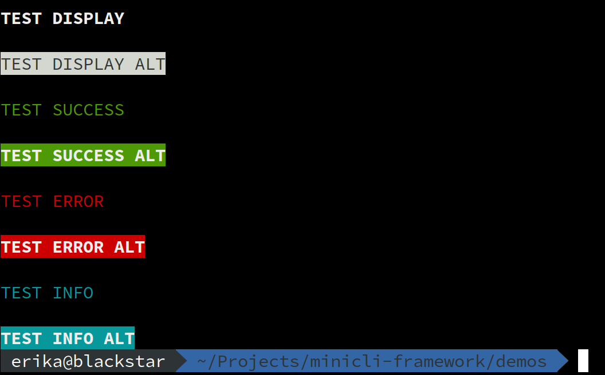
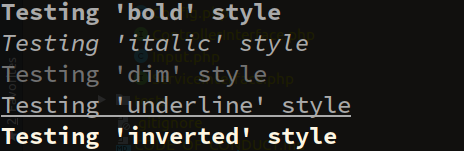
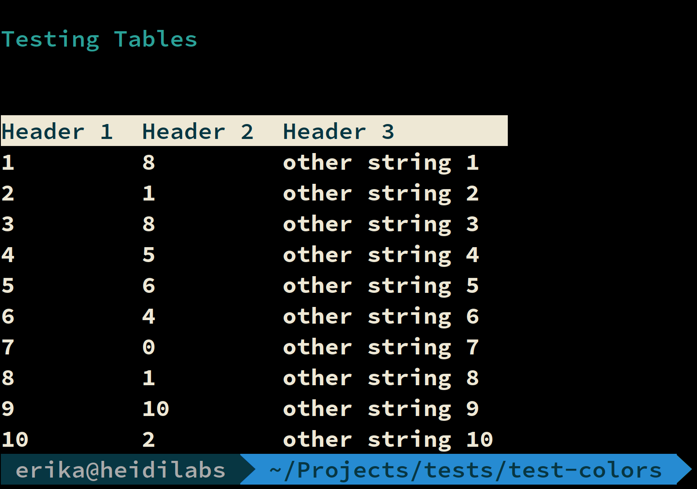

# Printing Output

The `OutputHandler` service has a series of methods to enable advanced output features, such as printing with colors, printing with pre-defined styles, and outputting content to a file instead of the default output.

This service is available at the application container as `printer`, also accessible via the helper method `getPrinter()` on controllers:


```php
<?php
...
    public function handle(): void
    {       
        $this->getPrinter()->display("Hello World!");
    }
```


This will print a "Hello World!" message wrapped in new lines, using default settings. 

## Printing with Pre-defined Styles

The following shortcut methods are available via the `OutputHandler` class:

- `display($message, $alt = false)` - Uses the `default` style. If `alt` is set to true, it will use the `alt` style.
- `info($message, $alt = false)` - Uses the `info` style. If `alt` is set to true, it will use the `info_alt` style.
- `error($message, $alt = false)` - Uses the `error` style. If `alt` is set to true, it will use the `error_alt` style.
- `success($message, $alt = false)` - Uses the `success` style. If `alt` is set to true, it will use the `success_alt` style.

Example of output produced by these methods:



### Other Print Methods

- `out($message, $style = null)` - Outputs a message and optionally sets a style. This won't include newlines.
- `rawOutput($message)` - Outputs a message without newlines or formatting.
- `newline()` - Prints a newline / line break.
- `printTable(array $table)` - Helper method that uses the `TableHelper` to format and print a table.

### Extended Styles

The `DefaultTheme` theme contains additional styles that can be used directly with the `out` method:

- `bold`
- `italic`
- `dim`
- `underline`
- `inverted`



Usage example:

```php
<?php
...
    public function handle(): void
    {   
        $this->getPrinter()->newline();    
        $this->getPrinter()->out("Hello World!", 'underline');
        $this->getPrinter()->newline(); 
    }
```

The same usage applies for creating custom styles within a [Custom Theme](/07-themes/).

!!!note
    Remember that the `out` method doesn't wrap the content with newlines, so you'll have to use the `newline()` method to manually include your line breaks.

### Printing Tables

You can also format content output in tables. The simplest way to do so is by building your data as an array, with headers as first row, and calling the `printTable()` method from the printer object.

The following single-command Minicli app prints an example table using this method:

```php
#!/usr/bin/env php
<?php

if (php_sapi_name() !== 'cli') {
    exit;
}

require __DIR__ . '/vendor/autoload.php';

use Minicli\App;
use Minicli\Exception\CommandNotFoundException;

$app = new App([
    'debug' => true,
    'theme' => '\Unicorn'
]);

$app->registerCommand('tables', function () use ($app) {
    $app->getPrinter()->display('Testing Tables');

    $content = [
        ['name', 'age', 'city'],
        ['Floor', 36, 'Amsterdam'],
        ['Alice', 23, 'London'],
        ['Bob', 39, 'New York'],
        ['Johnny', 28, 'Lagos']
    ];
    $app->getPrinter()->printTable($content);
});

try {
    $app->runCommand($argv);
} catch (CommandNotFoundException $notFoundException) {
    $app->getPrinter()->error("Command Not Found.");
    return 1;
}

return 0;
```

The command called with `./minicli tables` will output the following:


In some cases, you'll want to have more flexibility on the output created, and you may want to build the table in a more programmatically way. You can use the `TableHelper` to build your table before printing out.

As the name suggests, the `TableHelper` is a utility class to format output as a table. This method can receive an array upon instantiation with the contents to be printed, but you can also build the table programmatically as in the following example:

```php
#!/usr/bin/env php
<?php

if (php_sapi_name() !== 'cli') {
    exit;
}

require __DIR__ . '/vendor/autoload.php';

use Minicli\App;
use Minicli\Exception\CommandNotFoundException;
use Minicli\Output\Filter\ColorOutputFilter;
use Minicli\Output\Helper\TableHelper;

$app = new App([
    'debug' => true,
    'theme' => '\Unicorn'
]);

$app->registerCommand('tables', function () use ($app) {
    $app->getPrinter()->display('Testing Tables');

    $table = new TableHelper();
    $table->addHeader(['Header 1', 'Header 2', 'Header 3']);

    for($i = 1; $i <= 10; $i++) {
        $table->addRow([(string)$i, (string)rand(0, 10), "other string $i"]);
    }

    $app->getPrinter()->newline();
    $app->getPrinter()->rawOutput($table->getFormattedTable(new ColorOutputFilter()));
    $app->getPrinter()->newline();
});

try {
    $app->runCommand($argv);
} catch (CommandNotFoundException $notFoundException) {
    $app->getPrinter()->error("Command Not Found.");
    return 1;
}

return 0;
```
Once the table data is built with the `addRow()` method, you can use the `getFormattedTable()` method to obtain the raw content and output it using `rawOutput()`.


