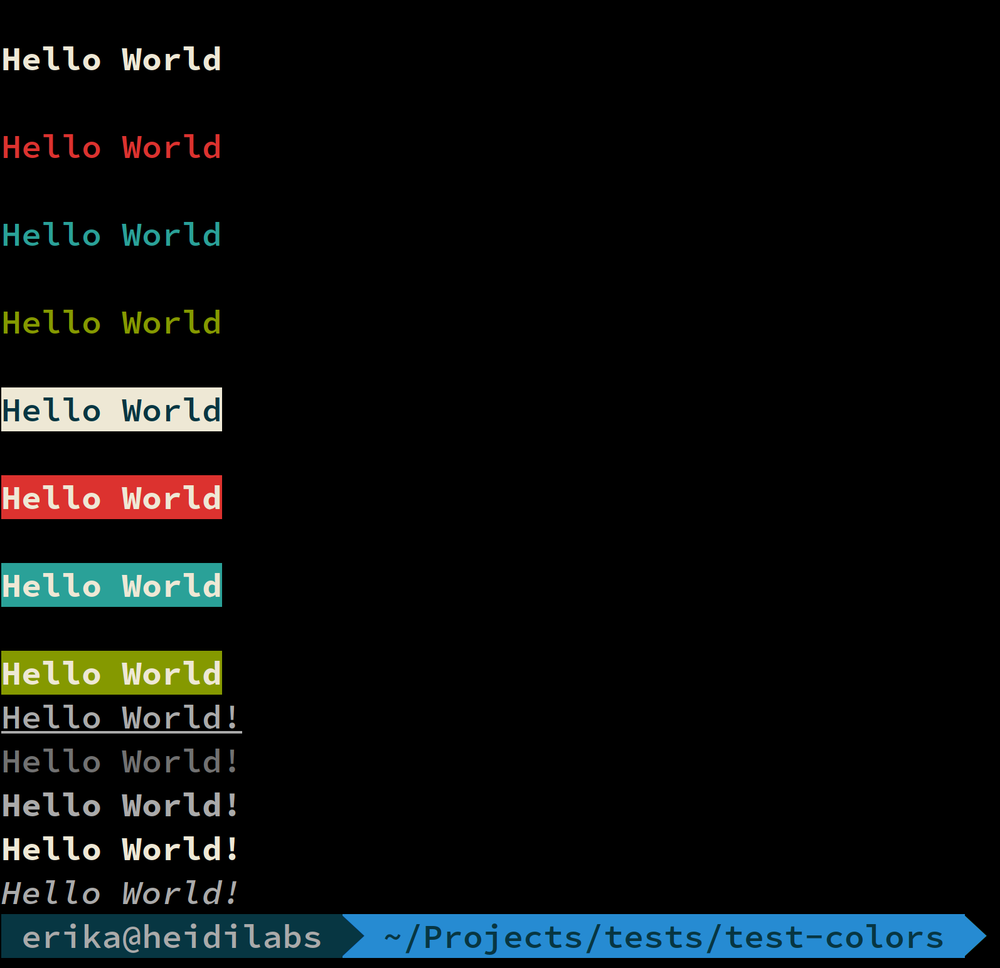
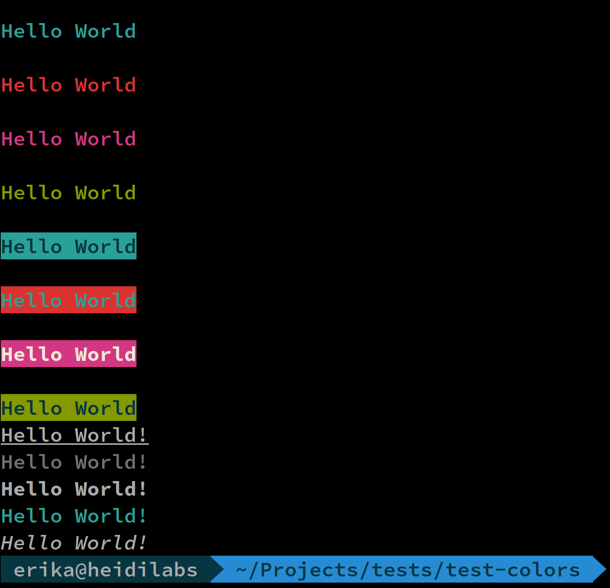
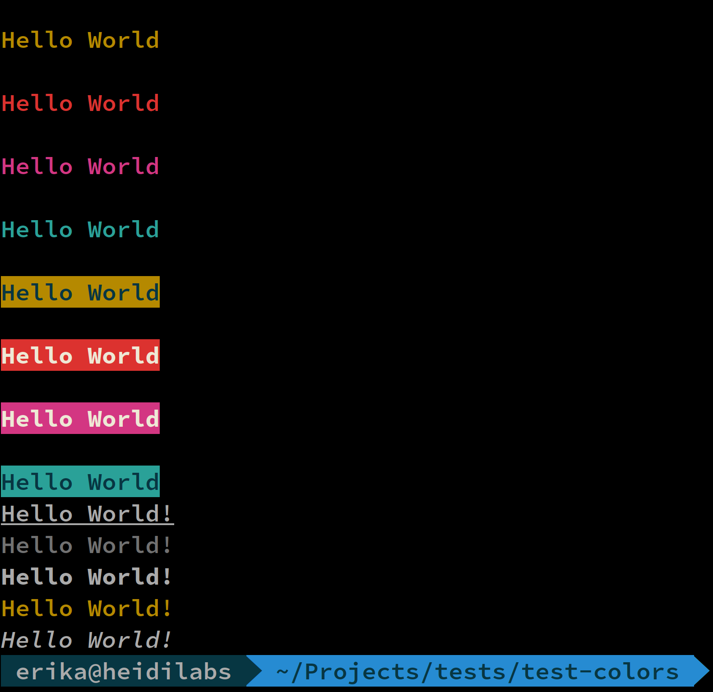
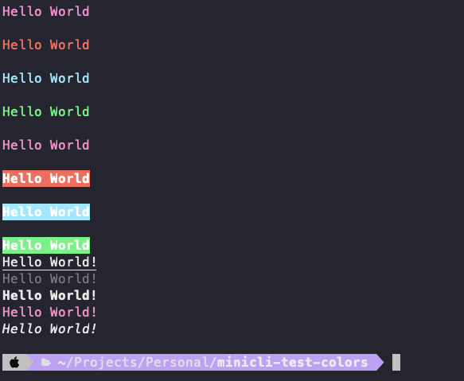

# Working with Color Themes

Minicli supports the use of color themes to change the style of command line output. The following built-in themes are currently available:

- [Default](#default): the default theme.
- [Unicorn](#unicorn): a more colorful theme.
- [Dalton](#dalton): a color-blind friendly theme.
- [Dracula](#dracula): a popular dark theme.

To set the theme, pass in a configuration array with a `theme` value when initializing the application. Built-in themes need a leading `\` character:

```php
$app = new App([
    'theme' => '\Unicorn'
]);
```

To use the default built-in theme, do not include the theme configuration setting, or set it to an empty string.

## Creating a Custom Theme

User-defined themes can also be created and defined in your project. In this case, set the theme name including its namespace without a leading `\`:


```php
$app = new App([
    'theme' => 'App\Theme\Blue'
]);
```

The above setting would use the following example theme:

```php
<?php
// File: app/Theme/BlueTheme.php

namespace App\Theme;

use Minicli\Output\Theme\DefaultTheme;
use Minicli\Output\CLIColors;

class BlueTheme extends DefaultTheme
{
    public function getThemeColors(): array
    {
        return [
            'default'     => [ CLIColors::$FG_BLUE ],
            'alt'         => [ CLIColors::$FG_BLACK, CLIColors::$BG_BLUE ],
            'info'        => [ CLIColors::$FG_WHITE],
            'info_alt'    => [ CLIColors::$FG_WHITE, CLIColors::$BG_BLUE ]
        ];
    }
}
```

User-defined themes only need to define styles which will override those in the default theme.

## Theme screenshots


### Default

When in doubt, stick to the default.



### Unicorn

A more colorful theme than the default  ¯\_(ツ)_/¯



### Dalton

A color-blind friendly theme contributed by [Tom Benevides](https://github.com/tombenevides).



### Dracula

A popular dark theme contributed by [Abdelrhman Said](https://github.com/AbdelrhmanSaid).



!!! note
    Note: Colors will vary depending on your CLI and system colors.

You can use the following Minicli script to reproduce this output:

```php
#!/usr/bin/env php
<?php

if (php_sapi_name() !== 'cli') {
    exit;
}

require __DIR__ . '/vendor/autoload.php';

use Minicli\App;
use Minicli\Exception\CommandNotFoundException;

$app = new App([
    'app_path' => __DIR__ . '/app/Command',
    'debug' => true,
    'theme' => '\Unicorn'
]);

$app->registerCommand('test', function () use ($app) {
    $app->display("Hello World");
    $app->error("Hello World");
    $app->info("Hello World");
    $app->success("Hello World");
    $app->display("Hello World",true);
    $app->error("Hello World",true);
    $app->info("Hello World",true);
    $app->success("Hello World",true);
    $app->out("Hello World!\r\n", 'underline');
    $app->out("Hello World!\r\n", 'dim');
    $app->out("Hello World!\r\n", 'bold');
    $app->out("Hello World!\r\n", 'inverted');
    $app->out("Hello World!\r\n", 'italic');
});

try {
    $app->runCommand($argv);
} catch (CommandNotFoundException $notFoundException) {
    $app->error("Command Not Found.");
    return 1;
} catch (Exception $exception) {
    if ($app->config->debug) {
        $app->error("An error occurred:");
        $app->error($exception->getMessage());
    }
    return 1;
}

return 0;
```


