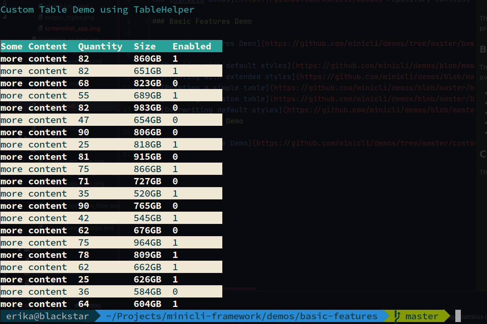
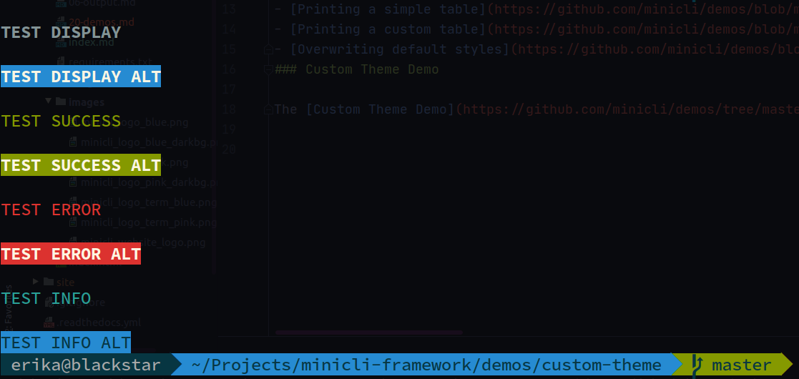

# Demos

The [Minicli Demos](https://github.com/minicli/demos) repository contains demos to showcase Minicli features in a more practical way.

### Basic Features Demo

The [Basic Features Demo](https://github.com/minicli/demos/tree/master/basic-features) shows how to print in various different styles, print tables, overwrite default theme styles and include custom styles of your own.

- [Printing with default styles](https://github.com/minicli/demos/blob/master/basic-features/app/Command/Styles/DefaultController.php)
- [Printing with extended styles](https://github.com/minicli/demos/blob/master/basic-features/app/Command/Styles/ExtendedController.php)
- [Printing a simple table](https://github.com/minicli/demos/blob/master/basic-features/app/Command/Table/DefaultController.php)
- [Printing a custom table](https://github.com/minicli/demos/blob/master/basic-features/app/Command/Table/CustomController.php)
- [Overwriting default styles](https://github.com/minicli/demos/blob/master/basic-features/app/Command/Styles/CustomController.php)

### Custom Theme Demo

The [Custom Theme Demo](https://github.com/minicli/demos/tree/master/custom-theme) shows how to set up a custom theme with Minicli.

